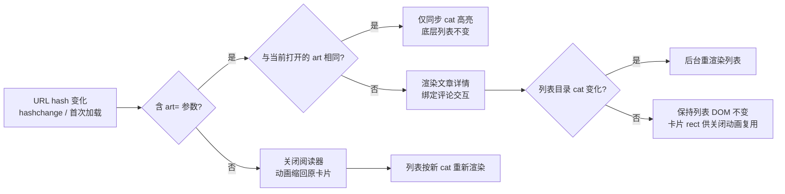

## 产品概述
将独立详情页 `article.html` 合并进首页：点击首页文章卡片后不再整页跳转，而是在右侧文章列表区域原位弹出"阅读面板"，以 Shared Element「卡片放大展开」动画呈现完整文章详情；关闭时动画缩回原卡片。整体视觉与交互延续站点现有深色玻璃拟态风格。

## 核心功能
- 点击文章卡片，卡片从当前位置"生长/放大"为完整阅读面板（覆盖右侧正文区，左侧分类导航与底部播放器保持可见可交互），关闭时反向缩回原卡片
- 阅读面板内容与现详情页一致：标题、浏览/评论/日期元信息、头图、正文段落、评论区（可发评论/回复/点赞/表情），右侧保留"推荐文章"栏
- 点击"推荐文章"可在面板内原地切换文章内容，不关闭面板
- 支持 Esc 键、关闭按钮、切换左侧分类等方式关闭返回列表
- 深链与浏览器前进/后退支持：URL 形如 `index.html#cat=diary&art=all-night-debug`，可直接打开/分享指定文章，刷新后自动弹出
- 合并独立详情页：删除 `article.html` 及其构建入口与全部引用，文章统一在首页弹层中阅读


## 技术栈
- 沿用现有 Vite 8 + Tailwind CSS v4 + 原生 ES Module 多页静态站方案，**不引入任何新依赖**，不改动 `mock-data.js` 数据结构、`dist/`、`vite.kanban-worktrees/` 与登录页逻辑
- 全部改动集中在 `/home/callmesoul/code/soul-blog-theme/vite/` 下

## 实现方案（总体思路）
将"详情渲染"重构为与页面无关的可复用渲染器，新增一个常驻于首页右侧内容列的"阅读器层"；开合与文章切换全部由 **URL hash 状态机**驱动（`#cat=<目录>&art=<文章id>`），列表渲染与阅读器开合监听同一 `hashchange` 事件，天然获得前进/后退/深链/分享能力；开合动画采用 **FLIP（transform translate+scale）**，纯合成器属性保证流畅。

### 状态机与数据流


### 关键设计决策
1. **hash 协议统一**：`getHashArt()` 从 hash 解析 `art=`（`getHashCat()` 现有正则天然兼容 `#cat=diary&art=...`）。打开 = 设置 hash（产生历史条目）；推荐原地切换 = `history.replaceState`（不污染历史，返回键直接回到列表）；关闭 = 移除 `art=`。列表 `render()` 在 hashchange 中增加守卫：仅当 `cat` 变化或阅读器已关闭时才重建网格，保证打开期间卡片 rect 稳定、关闭动画有可靠目标。
2. **阅读器层级**：在首页右侧内容列（面包屑+列表区所在 flex 列）设 `position:relative`，阅读器为其中 `position:absolute; inset:0` 的覆盖层（z-index 高于列表、低于底部播放器所在行），内含 backdrop（渐暗+玻璃模糊）与 `viewer-panel`。左侧 372px 侧栏与 50px 播放器天然保留在覆盖范围之外，满足"仍可见可交互"。
3. **FLIP 开合动画（分相避免文字拉伸发虚）**：
   - 开：backdrop 淡入 → `.viewer-shell`（深色面板壳，内含被点击卡片的封面克隆图）从卡片 `getBoundingClientRect()` 经 FLIP 变换（`translate`+`scale`，`transform-origin: top left`，约 380ms，缓动 `cubic-bezier(0.22, 1, 0.36, 1)`）放大到最终矩形；放大到位后真实内容（标题/元信息/头图/正文/推荐栏）按 40ms 间隔依次淡入上浮，克隆封面淡出——封面同一资源无跳变；
   - 关：内容先快速淡出（约 100ms），壳再 FLIP 缩回原卡片矩形（约 280ms），backdrop 同步淡出，最后 `hidden` 隐藏；
   - 深链直达/卡片不在视口时降级为"backdrop 淡入 + 面板轻微放大上浮"；`prefers-reduced-motion` 时跳过动画直接显隐。
4. **评论交互重构为根作用域事件委托**：阅读器容器创建后一次性绑定（发评论/回复/点赞/表情/提交按钮态/评论数同步），切换文章只重建 `.comment-list` 等内容 DOM，委托事件天然继续生效，避免重复绑定与 emoji 面板重复注入。
5. **推荐原地切换**：点击 `.recommend-item` 触发轻量内容转场（封面交叉淡化+内容快速淡入，约 200ms），经 `replaceState` 更新 URL，不关闭面板。
6. **导航点击（切目录）**：左侧导航 href 为 `index.html#cat=xxx`，点击后 hash 中 `art=` 消失 → 阅读器执行收拢动画并关闭，列表按新目录渲染——一条路径同时解决"切目录即返回列表"。

### 实现注意事项（防止回归）
- **防列表重绘**：打开期间禁止 `hashchange → render()` 重建网格，否则原卡片 rect 失效；用 `lastCatRendered`/`viewerActive` 状态做守卫。
- **性能**：动画只动用 `transform/opacity`，配合 `will-change`，`transitionend` 后清理；矩形读取集中测量避免布局抖动；不产生新的滚动监听（阅读器内独立滚动容器）。
- **可访问性**：阅读器用 `role="dialog"` + 可见标签；打开时焦点移至关闭按钮、关闭时归还焦点到原卡片；Esc 关闭；背景列表设 `aria-hidden` 过渡管理（侧栏与播放器保持可交互，按用户选择不做全模态 inert）。
- **状态同步**：打开时 `syncNav(art.cat)` 高亮所属目录、`document.title` 切换为文章标题；关闭后恢复列表 cat 高亮与默认标题。
- **入口收敛**：`cardHtml`/`recItemHtml` 的 href 全部由 `article.html?id=x` 改为 `index.html#cat=..&art=..`；在网格容器上做一次事件委托拦截左键点击（`preventDefault` 后写 hash），`Ctrl/Cmd/中键` 放行新标签。
- **清理**：删除 `article.html` 前，将 `index.html`/`login.html` 静态预置 HTML 中残留的 `article.html` 锚点改为 `index.html#cat=...`（运行期本就被 `initNav` 重绘，仅防 JS 前的 404 闪烁）；移除 `initBlogDetail`、`getArticleCat` 及 `initNav` 中 article 分支等死代码。
- 不输出日志噪声、无敏感信息；文件改动遵循现有"模块顶部注释 + 函数注释"风格。

## 目录结构与文件清单

```
vite/
├── index.html                  # [MODIFY] 右侧内容列插入阅读器挂载容器 <div id="article-viewer" hidden>
│                               #           静态预置卡片/导航中残留 article.html 链接改为 index.html#cat=...（运行期本被重绘，仅防闪烁）
├── article.html                # [DELETE] 详情页整体移除（已并入首页弹层）
├── vite.config.js              # [MODIFY] build.rollupOptions.input 移除 article 入口
└── src/
    ├── css/style.css           # [MODIFY] 新增：.article-viewer/.viewer-backdrop/.viewer-shell/.viewer-panel/
    │                           #           阅读主区与 373px 推荐栏（复用 .recommend-item）、关闭按钮、FLIP 动画关键帧、
    │                           #           内容交错入场/离场、窄视口（≤1199/≤900）断点适配、prefers-reduced-motion 降级
    └── js/main.js              # [MODIFY] 核心改造（详见 todolist）
```

## 核心结构约定（供实现参照）
```html
<!-- 阅读器骨架（JS 模板注入 #article-viewer 挂载点，或直接静态写入） -->
<div class="article-viewer" role="dialog" aria-modal="false" hidden>
  <div class="viewer-backdrop"></div>          <!-- 渐暗 + 玻璃模糊 -->
  <div class="viewer-shell">…封面克隆 + 面板壳…</div><!-- FLIP 变换载体 -->
  <div class="viewer-panel">                   <!-- 最终几何尺寸，缩放目标 -->
    <header class="viewer-head">
      <span class="viewer-crumb">目录名</span>
      <button class="viewer-close" aria-label="关闭阅读">×</button>
    </header>
    <div class="viewer-body">
      <main class="viewer-main"><!-- 标题/元信息/头图/.article-content/#comment-form/.comment-list --></main>
      <aside class="viewer-recommend"><!-- "推荐文章 Recommend" + #recommend-list --></aside>
    </div>
  </div>
</div>
```
约定：详情渲染器签名 `renderArticleDetail(root, art)`（填充标题/元信息/头图/正文/评论区/推荐栏，供首页弹层与深链复用）；`openArticle(id)`/`closeArticle()`/`switchArticle(id)` 三个控制器；hash 解析统一走 `getHashCat()`（沿用）+ 新增 `getHashArt()`。

## 实施说明
优先复用现有 `commentItemHtml`/`recItemHtml`/`cardHtml`/`escHtml`/`store`/`syncNav` 等既有函数与 `style.css` 主题变量；重构范围限定在阅读器相关链路，不改动播放器、社交图标、导航高亮、懒加载与无限滚动主流程以外的逻辑。


## 设计风格
延续站点 PSD 复原的"暗黑玻璃拟态"视觉体系，不做框架迁移。阅读面板本质是详情页在首页右侧区的"第二层舞台"：面板采用深色磨砂玻璃底（rgba(15,14,13,0.55) + blur 16px saturate 120%）、细 1px 分隔线、品牌橙 #EB4F38 点缀，与背景大图叠加出通透层次。

## 页面规划与块设计（阅读面板为唯一新增视图）
按自上而下、左主右辅双栏规划，面板共 5 个功能块：
- 顶层遮罩 backdrop：点击可关闭；暗化 + 轻模糊，让底部网格透出轮廓又聚焦正文
- 面板头部（viewer-head）：左侧当前目录名（灰色小字，阅读语境下替代面包屑），右上角常驻圆形关闭钮（hover 变品牌橙、旋转 90° 微动效）
- 主区-文章头（viewer-main 顶部）：18px SimSun 白色标题 → 元信息行（浏览/评论/日期三组小图标浅灰）
- 主区-正文与评论：头图 max-height 400px 圆角 2px → 13px Arial #9E9D99 lh1.8 正文（max-width 794px）→ 分隔线 → 评论区（沿用现有输入框/回复/点赞/表情样式）
- 右栏（373px）："推荐文章 Recommend" 标题 + 缩略图列表，悬停右移高亮；窄视口自动隐藏，主区占满

## 交互与转场
点击卡片 → 卡片"生长"放大为面板（FLIP，弹性缓动）；内容按序交错淡入上浮形成节奏感；关闭反向收拢缩回卡片。推荐切换用轻量交叉淡化。所有微交互（关闭钮旋转、卡片 hover 上浮、正文链接 hover）控制在 200-300ms，保持"动态但不打扰"。

## 计划使用的 Agent 扩展
### Skill
- **lsp-code-analysis**
  - Purpose: 在重构 `main.js` 前后做语义级影响分析——确认 `initBlogDetail`、`initComments`、`commentItemHtml`、`recItemHtml`、`cardHtml`、`getArticleCat` 的定义/全部引用/调用链，避免删除 `article.html` 或抽取渲染器时遗漏调用点
  - Expected outcome: 得到精确的引用清单，保证重构后无悬挂引用、启动函数列表（DOMContentLoaded）与死代码清理完全正确

### SubAgent
- **code-explorer**
  - Purpose: 在执行末期做跨目录收尾核查：扫描 `vite/`（排除 dist、vite.kanban-worktrees、node_modules）中所有残留 `article.html` 字符串、`initBlogDetail` 等死代码与构建入口引用，确认清理彻底
  - Expected outcome: 输出残留引用清单，使"删除 article.html + 配置/引用清理"一步到位且可验证
