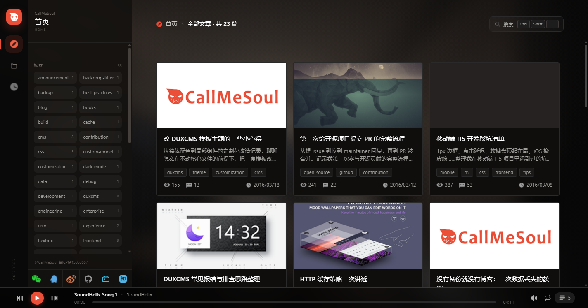
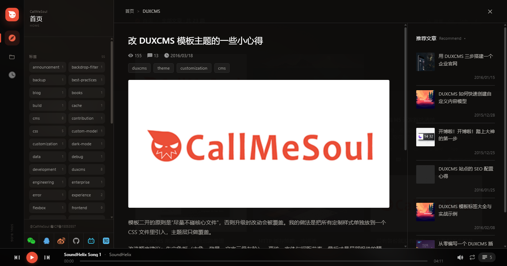
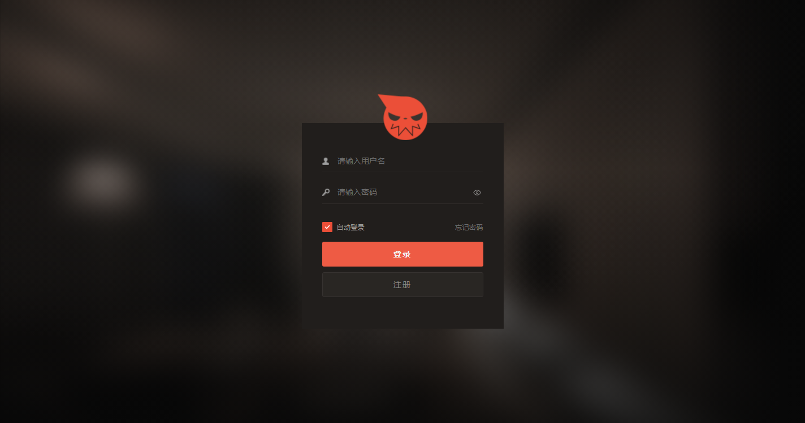
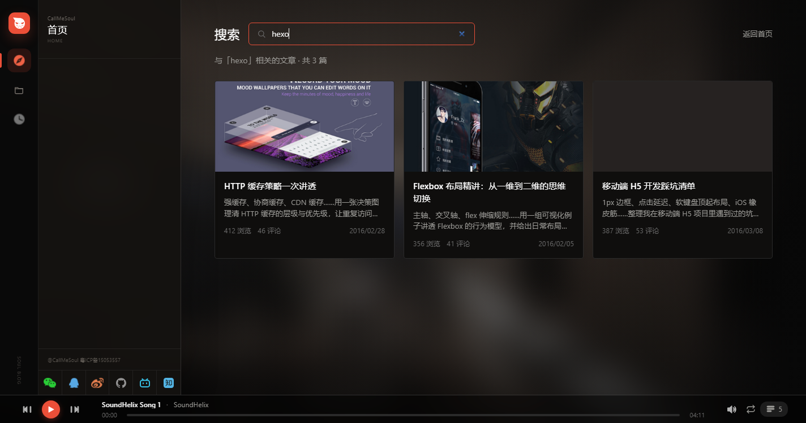
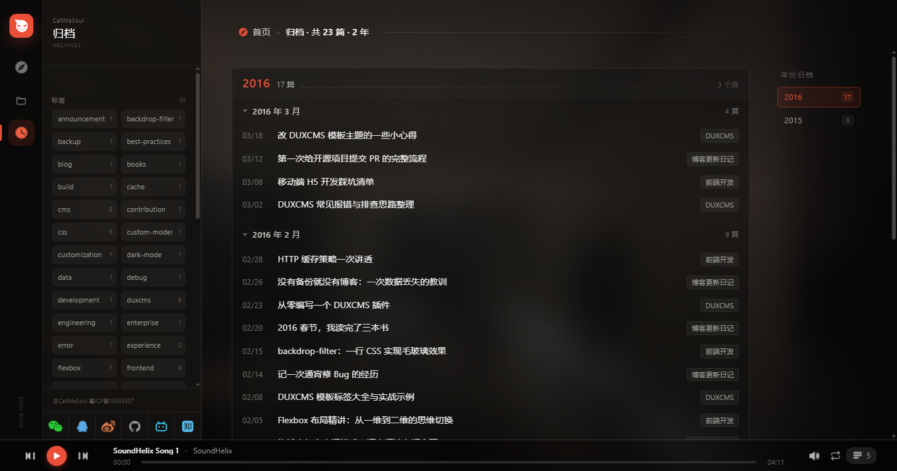
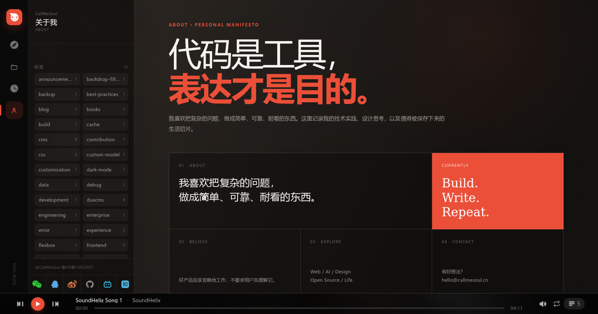
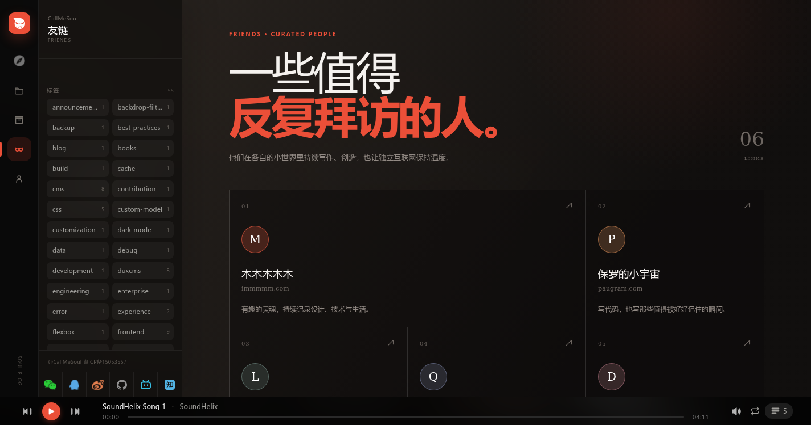

# soul-blog-theme

基于 **Web Components** 的跨框架博客主题，一套 UI 同时适配原生 JS、Vue、React、Hexo。

核心组件库 `@soul-blog/wc` 使用 Shadow DOM 封装，不依赖任何前端框架，各端通过 thin wrapper 按需集成。

## ✨ 特性

- 🎨 **跨框架一致体验** — 一套核心组件同时支持 Vanilla/Vue/React/Hexo

- 🔍 **全文模糊搜索** — 支持标题、目录、正文关键词模糊搜索，支持键盘导航；既可热键唤起弹出层，也可访问独立 `/search` 结果页

- 🎬 **FLIP 翻转动画** — 从文章卡片到详情页无缝过渡动画

- 🎵 **底部音乐播放器** — 支持播放列表、音量记忆、跨页状态保持、循环 / 单曲 / 随机三种播放模式

- 🌌 **动态背景** — 粒子 / 星尘动效，视觉层次感丰富

- 🗂 **归档时间线** — 按 年 → 月 → 文章 三级倒序归档，年份快捷导航、月份可折叠、滚动触底自动续载（IntersectionObserver）

- 👤 **关于我页面** — 杂志式卡片布局的自我介绍页（Manifesto 卡片、Currently 状态、联系方式），内容由 `site-config.json` 的 `about` 字段驱动，改配置即改页面

- 🤝 **动态友链画廊** — 人物画廊式非对称卡片，支持字符标识或头像；Vanilla、Vue、React 与 Hexo 共用核心组件，内容由站点配置驱动
- 📦 **Hexo 独立运行包** — 发布包包含模板、脚本、JS/CSS、默认图片和音乐；个人配置与资源放在站点独立目录，主题可整体替换更新
- 💬 **Giscus 文章评论** — 基于 GitHub Discussions，按稳定文章键隔离评论；支持 Vanilla、Vue、React 与 Hexo，切换阅读器文章时自动切换 Discussion

- 📖 **沉浸式文章阅读** — 桌面端控制舒适行宽并强化标题、列表、引用、代码块与图片层级；移动端切换为完整单栏滚动，推荐内容自然衔接在正文之后

- 🧭 **面包屑导航** — 文章阅读器、归档页统一展示「首页 > 目录 > 文章」路径

- 🏷 **标签筛选** — 侧栏标签云、文章卡片 tag chip、阅读器内 tag 一键回列表过滤

- 📈 **访问统计** — 四套主题统一接入 Vercount 站点 PV / UV 与单篇文章阅读量，首页文章列表同步展示动态计数

- 📱 **响应式布局** — 适配桌面、平板、移动设备

- 🔐 **登录页** — 带密码验证、记住用户名、自动登录的私有文章入口

- ⚡ **性能优化** — 组件懒加载、图片懒加载、搜索防抖、归档/年份侧栏 IntersectionObserver 续载

## 📸 截图预览

|                     首页                    |                  文章阅读器                   |
| :-------------------------------------: | :--------------------------------------: |
|  |  |
|                   **登录页**                  |                   **搜索页**                  |
|  |  |
|                   **归档页**                  |                 **关于我**                  |
|  |  |
|                   **友链**                   |                                          |
|  |                                          |

## 🗂️ 项目架构

```
soul-blog-theme/
├── packages/
│   └── core/                      # @soul-blog/wc — 框架无关的组件库（唯一 UI 真源）
│       └── src/
│           ├── components/        # 11 个 Web Components（Shadow DOM + 自包含样式）
│           ├── helpers/           # 工具函数（wc-base、store、search、escape-html、format-time）
│           ├── styles/            # Tailwind v4 主题变量与设计令牌
│           └── types/             # TypeScript 类型契约（Article / Category / FriendLink 等）
│
├── themes/
│   ├── vanilla/                   # 原生 JS 主题（Vite 多页应用）
│   ├── vue/                       # Vue 3 主题（Pinia + Vue Router）
│   ├── react/                     # React 18 主题（Zustand + React Router）
│   └── hexo/                      # Hexo 博客主题（EJS 模板 + Vite 构建）
│
├── assets/
│   ├── site-config.json           # 品牌信息 / 社交栏 / 主题色（运行时可热覆盖）
│   ├── screenshots/               # README 引用截图
│   ├── images/                    # 站点图片资源
│   └── audio/                     # 音乐播放器默认曲目
│
├── fixtures/
│   └── hexo/                      # 仓库内置 Hexo 预览配置与示例文章
│
├── design/                        # 原始设计稿（PSD / PNG）
│
├── pnpm-workspace.yaml
└── package.json
```

## 组件清单

`@soul-blog/wc` 提供以下 Web Components：

| 组件             | 标签                  | 功能                                          |
| -------------- | ------------------- | ------------------------------------------- |
| SiteBackground | `<site-background>` | 背景粒子 / 星尘动效                                  |
| SiteSidebar    | `<site-sidebar>`    | 双轨侧栏：首页 / 目录 / 归档 / 友链 / 关于 + 分类、社交、标签云           |
| ArticleList    | `<article-list>`    | 文章卡片网格（分类筛选、标签筛选、入场动画、滚动续载）                 |
| ArchiveList    | `<archive-list>`    | 归档时间线（年 → 月 → 文章、年份快捷导航、月份折叠、滚动续载）           |
| AboutPage      | `<about-page>`      | 关于我页面（杂志式卡片布局，内容由 site-config 的 `about` 驱动）       |
| FriendsPage    | `<friends-page>`    | 友链人物画廊（动态标题、链接、标识、颜色及可选头像）                    |
| ArticleViewer  | `<article-viewer>`  | 响应式文章阅读器（FLIP 动画、富文本排版、Giscus 评论、相关推荐、tag 点击路由）  |
| SearchPanel    | `<search-panel>`    | 搜索弹出层（模糊搜索、键盘导航；Ctrl/Cmd + Shift + F 唤起）      |
| SearchResults  | `<search-results>`  | 搜索结果列表（独立 `/search` 路由，复用 ArticleList 渲染逻辑）     |
| MusicPlayer    | `<music-player>`    | 音乐播放器（进度、音量、播放列表、跨页保持状态、3 种播放模式）             |
| LoginPanel     | `<login-panel>`     | 登录面板（密码显隐、错误提示、记住用户名、自动登录）                    |

## 技术栈

### 核心层

| 依赖                                          | 用途            |
| ------------------------------------------- | ------------- |
| [Vite 8](https://vite.dev/)                 | 构建工具          |
| [Tailwind CSS v4](https://tailwindcss.com/) | 样式实现          |
| Web Components (Shadow DOM)                 | 组件封装，框架无关     |
| TypeScript                                  | 类型安全          |

### 各端框架

| 主题       | 状态管理    | 路由             | 额外依赖                       |
| -------- | ------- | -------------- | -------------------------- |
| Vanilla  | 模块级变量   | Hash 路由        | —                          |
| Vue 3    | Pinia   | Vue Router 4   | `@vitejs/plugin-vue`       |
| React 18 | Zustand | React Router 6 | `@vitejs/plugin-react`     |
| Hexo     | —       | Hexo 7 路由      | EJS 模板                     |

## 快速开始

### 环境要求

- Node.js >= 20

- pnpm >= 9

### 安装依赖

```bash
pnpm install
```

### 构建核心组件库

```bash
pnpm --filter @soul-blog/wc build
```

### 构建各端主题

```bash
# 原生 JS 主题
pnpm build:vanilla

# Vue 3 主题
pnpm build:vue

# React 18 主题
pnpm build:react

# Hexo 主题
pnpm build:hexo
```

### 本地开发

同时启动全部主题的开发任务：

```bash
pnpm dev:all
```

该命令会并行启动 Vanilla、Vue、React 的预览服务、Hexo 主题资源监听构建，以及使用 `fixtures/hexo` 内置开发站点的 `hexo server`。无需提前创建或同步 `/tmp/hexo-test`；需要生成静态产物时，输出目录已指向该路径。

各主题默认端口：

| 主题       | 端口   | 命令                 |
| -------- | ---- | ------------------ |
| Vanilla  | 5173 | `pnpm dev:vanilla` |
| Vue 3    | 5174 | `pnpm dev:vue`     |
| React 18 | 5175 | `pnpm dev:react`   |
| Hexo     | 4000 | `pnpm dev:hexo`    |

```bash
# 构建核心库（watch 模式）
pnpm dev:core

# 原生 JS 主题
pnpm dev:vanilla

# Vue 3 主题
pnpm dev:vue

# React 18 主题
pnpm dev:react

# Hexo 主题资源（watch 模式）+ 内置预览站点
pnpm dev:hexo
```

> 端口被占用时 Vite 会自动顺延（+1），以启动时实际输出的地址为准。

## 路由 & 页面

各端均提供一致的页面结构（具体路由名以各端实现为准）：

| 页面           | 用途                       | 关键组件                                  |
| ------------ | ------------------------ | ------------------------------------- |
| `/`          | 首页：分类 / 标签筛选 + 文章卡片网格    | `site-sidebar`、`article-list`          |
| `/articles/:id` | 文章阅读器（FLIP 翻转打开）      | `article-viewer`、面包屑                   |
| `/search`    | 独立搜索结果页                  | `search-results`                       |
| `/archives`  | 归档时间线（年 → 月 → 文章）        | `archive-list`                         |
| `/about`     | 关于我（杂志式卡片自我介绍页）        | `about-page`                           |
| `/friends`    | 友链（人物画廊式卡片列表）          | `friends-page`、`site-sidebar`            |
| `/login`     | 登录页                      | `login-panel`                          |

> Vanilla 版友链入口为 `friends.html`，Vue 版为 `#/friends`，React 与 Hexo 版为 `/friends`。Hexo 归档对应 `/archives/`（默认 `archive_dir`），正文页在归档 / 首页里通过 FLIP 翻转在原地弹出阅读器，无独立文章页 URL，便于静态托管 SEO。

## 站点配置

品牌信息（logo、主色、社交栏、备案文案）通过 `site-config.json` 配置，运行时生效优先级由高到低：

1. `public/site-config.json` — 部署后直接编辑，无需重新打包
2. `window.__SITE_CONFIG__` — 运行时注入（控制台 / 后台直出）
3. 内置默认值（兜底）

配置字段说明（深合并，数组整体替换、对象逐层覆盖）：

```json
{
  "site": {
    "name": "CallMeSoul",
    "icp": "@CallMeSoul 粤ICP备15053557"
  },
  "logo": {
    "home": { "src": "/images/logo-home.png", "width": 60, "height": 55, "alt": "CallMeSoul" },
    "login": { "src": "/images/logo-login.png", "width": 201, "height": 35, "alt": "CallMeSoul" },
    "loginIcon": { "src": "/images/logo-icon.png", "width": 88, "height": 81, "alt": "" }
  },
  "theme": {
    "primary": "#EB4F38",
    "cta": "#EE5B44"
  },
  "about": {
    "kicker": "About · Personal Manifesto",
    "title": "代码是工具，",
    "titleAccent": "表达才是目的。",
    "description": "一句话简介（标题下方段落）",
    "cards": [
      { "eyebrow": "01 · About", "title": "卡片大标题，\\n 支持换行", "variant": "wide" },
      { "eyebrow": "Currently", "title": "Build.\\nWrite.\\nRepeat.", "variant": "accent" },
      { "eyebrow": "02 · Believe", "text": "纯文本卡片" },
      { "eyebrow": "04 · Contact", "text": "有好想法？\\nhello@example.com", "href": "mailto:hello@example.com" }
    ]
  },
  "friends": {
    "kicker": "Friends · Curated People",
    "title": "一些值得",
    "titleAccent": "反复拜访的人。",
    "description": "友链页标题下方的介绍",
    "links": [
      {
        "name": "朋友的站点",
        "url": "https://example.com",
        "domain": "example.com",
        "note": "一句话介绍",
        "mark": "E",
        "color": "#6D8580",
        "avatar": "/images/friends/example.png"
      }
    ]
  },
  "giscus": {
    "enabled": true,
    "repo": "owner/repo",
    "repoId": "R_...",
    "category": "Announcements",
    "categoryId": "DIC_...",
    "termPrefix": "article:",
    "strict": true,
    "reactionsEnabled": true,
    "inputPosition": "top",
    "theme": "dark_dimmed",
    "lang": "zh-CN",
    "loading": "lazy"
  },
  "social": [
    { "name": "微信", "icon": "/images/weixin.png", "href": "", "qr": "/images/qr-weixin.svg", "hue": 74, "width": 22, "height": 18 }
  ],
  "archiveUrl": "/archives/",
  "homeUrl": "/"
}
```

Giscus 默认开启。必要字段未填写完整时，文章评论区会直接展示配置引导，不会加载无效 iframe。请先在目标 GitHub 仓库开启 Discussions、安装 [Giscus App](https://github.com/apps/giscus)，再通过 [Giscus 配置页](https://giscus.app/zh-CN) 获取 `repoId` 与 `categoryId`。主题固定使用 `specific` 映射，并以 `termPrefix + article.commentKey`（缺省回退 `article.id`）作为 Discussion 键，避免 Hash/Query SPA 中多篇文章共用同一个 pathname 而串评论。Hexo 对应字段使用 snake_case（如 `repo_id`、`category_id`）；如需恢复内置演示评论区，可设置 `enabled: false`。

> **社交栏交互规则**：`href` 为有效外链 → 新窗口跳转；`href` 为空但有 `qr` → hover 弹二维码；两者皆无 → 纯展示图标。

> **关于我页**：`about.cards` 每项为一张卡片，`variant: "wide" | "accent"` 控制大卡/强调色卡，缺省为普通卡；`href` 存在时整卡可点击。

> **友链页**：`friends.links` 按数组顺序渲染并整体替换默认列表；`url` 为实际跳转地址，`domain` 仅控制展示文案，`avatar` 可选，缺省时依次使用 `mark` 和站名首字符。Hexo 在主题 `_config.yml` 中配置同名 `friends` 节点，并使用 `title_accent` 等 snake_case 字段，另支持 `enabled: false` 关闭 `/friends/` 页面生成、`path` 自定义路由（默认 `friends`，对应 `page_title` 为页面标题）。

## 数据接入

各端数据源通过 `TypeScript` 类型契约约束，字段结构一致即可无缝替换：

### 文章 (`Article`)

```typescript
interface Article {
  id: string
  statsKey?: string    // 访问统计稳定键（缺省回退 id）
  commentKey?: string  // 评论系统稳定键（缺省回退 id）
  cat: string          // 所属分类 id
  title: string
  cover: string
  summary: string
  date: string         // 'YYYY/MM/DD'
  views: number
  commentCount: number
  tags?: string[]      // 标签列表（用于筛选 / 卡片 chip）
  paragraphs: string[]
  comments?: ArticleComment[]
}
```

### 分类 (`Category`)

```typescript
interface Category {
  id: string
  name: string         // 展示名（中文）
  en: string           // 英文名 / 副标
  icon: string         // 目录图标 URL
  w: number            // 图标宽度（px）
  h: number            // 图标高度（px）
  count?: number       // 该分类下文章数（可选，用于卡片摘要）
}
```

## 键盘快捷键

| 快捷键                    | 功能                                       |
| ---------------------- | ---------------------------------------- |
| `Ctrl/Cmd + Shift + F` | 打开搜索弹出层（`search-panel`）                |
| `↑ / ↓`                | 在搜索面板 / 阅读器中切换                          |
| `Enter`                | 打开当前结果 / 确认操作                            |
| `Esc`                  | 关闭搜索 / 返回列表 / 关闭阅读器                     |

## 开发指南

### TypeScript 类型检查

```bash
# 核心库
pnpm --filter @soul-blog/wc typecheck

# Vue 主题
pnpm --filter @soul-blog/vue typecheck

# React 主题（内嵌在 build 流程中）
pnpm --filter @soul-blog/react build
```

### Hexo 主题集成开发工作流

仓库内置 `fixtures/hexo` 预览配置与示例文章，并直接加载当前的 `themes/hexo`，因此不需要再复制主题目录。修改核心组件后先重新构建 Core，再启动 Hexo 开发任务：

```bash
cd /path/to/soul-blog-theme
pnpm build:core
pnpm dev:hexo
```

`pnpm dev:hexo` 会同时监听构建主题资源并启动 `http://localhost:4000/`。也可以用 `pnpm dev:all` 连同另外三套主题一起启动。

### 生产部署 Hexo

从 v1.9.0 开始，优先使用 GitHub Release 的 `soul-blog-hexo-vX.Y.Z.tar.gz`，它包含 EJS 模板、CommonJS 主题脚本、默认配置、JS/CSS 和完整默认图片/音频；无需在使用站点安装 pnpm 或构建 monorepo。Git tag 源码不包含运行产物，不能用源码压缩包代替运行包。

主题维护者本地打包：

```bash
pnpm install --frozen-lockfile
pnpm package:hexo
```

输出在 `dist/hexo/`：版本压缩包、`hexo-release.json`（含版本、提交、包 SHA256）及 `SHA256SUMS`。解压后得到 `hexo/` 主题目录，放在站点 `themes/hexo/`，并在站点 `_config.yml` 设置 `theme: hexo`，再运行 `hexo generate`。发布包里的 `theme.json` 可追溯构建源码；本地未提交的包标记为 `dirty`，仅供预览。

使用站点应把 `themes/hexo/` 当作可整体删除并重建的目录：个人配置维护在 `theme/config.yml`，个人资源维护在 `theme/assets/images/`、`theme/assets/audio/`。安装器先校验发布包并准备完整目录，再将默认配置与个人配置合并（对象逐层覆盖、数组整体替换，`[]` 清空），最后覆盖个人资源并替换主题。未修改的默认资源不要复制进个人覆盖目录，未填写的配置继承新版本默认值。

`callmesoul.github.io` 站点已采用此流程：`npm run theme:update -- vX.Y.Z` 安装并锁定版本及 SHA256，`npm run dev` / `npm run build` 自动同步；下载或配置解析失败保留旧主题。旧版 v1.8.0 无运行包，保留源码构建兼容路径，安装新版发布包后切换到直接下载。

正式发布前按 AGENTS.md 完成统一版本、CHANGELOG、README 后提交，并推送对应 `vX.Y.Z` tag。`.github/workflows/release-hexo.yml` 会重新构建、验证 tag/版本/最新 CHANGELOG 和干净工作区，再创建或使用 GitHub Release 上传三个产物；不会覆盖已有同名资源。

### 添加新组件

1. 在 `packages/core/src/components/` 中创建 Web Component（继承 `WcBase`）
2. 在 `packages/core/src/components/index.ts` 中注册
3. 在各端主题中创建对应的 thin wrapper 组件
4. 重新构建 core 和各端主题

## 🎨 主题定制

设计令牌定义在 `packages/core/src/styles/theme.css`（与 `themes/vanilla/src/css/style.css` 同源，跨端复用）：

```css
:root {
  /* 品牌色（可在 site-config.theme 中按页面动态覆盖） */
  --brand-primary: #EB4F38;   /* 主题主色 */
  --brand-cta: #EE5B44;        /* 按钮强调色 */

  /* 中性面板色 */
  --color-base: #080808;       /* 页面底色 */
  --color-card: #0f0e0d;       /* 侧栏 / 卡片 / 播放列表面板 */
  --color-panel: #141210;      /* 音量面板 */

  /* 文字色阶 */
  --color-ink: #ffffff;        /* 一级 */
  --color-body: #f2f2f2;       /* 二级正文 */
  --color-mute: #9e9d99;       /* 三级元信息 */
  --color-dim: #6b6b6b;        /* 四级时间等 */

  /* 分隔线 / 边框 */
  --color-line: #2a2a2a;       /* 常规边框 */
  --color-sep: #333333;        /* 列表分隔 / 社交栏顶线 */
}
```

修改后重新构建即可生效。

## ☕ 打赏

如果这个项目对你有用，可以请我喝杯奶茶 🧋

<div align="center">
  
</div>

## 📝 许可

MIT
